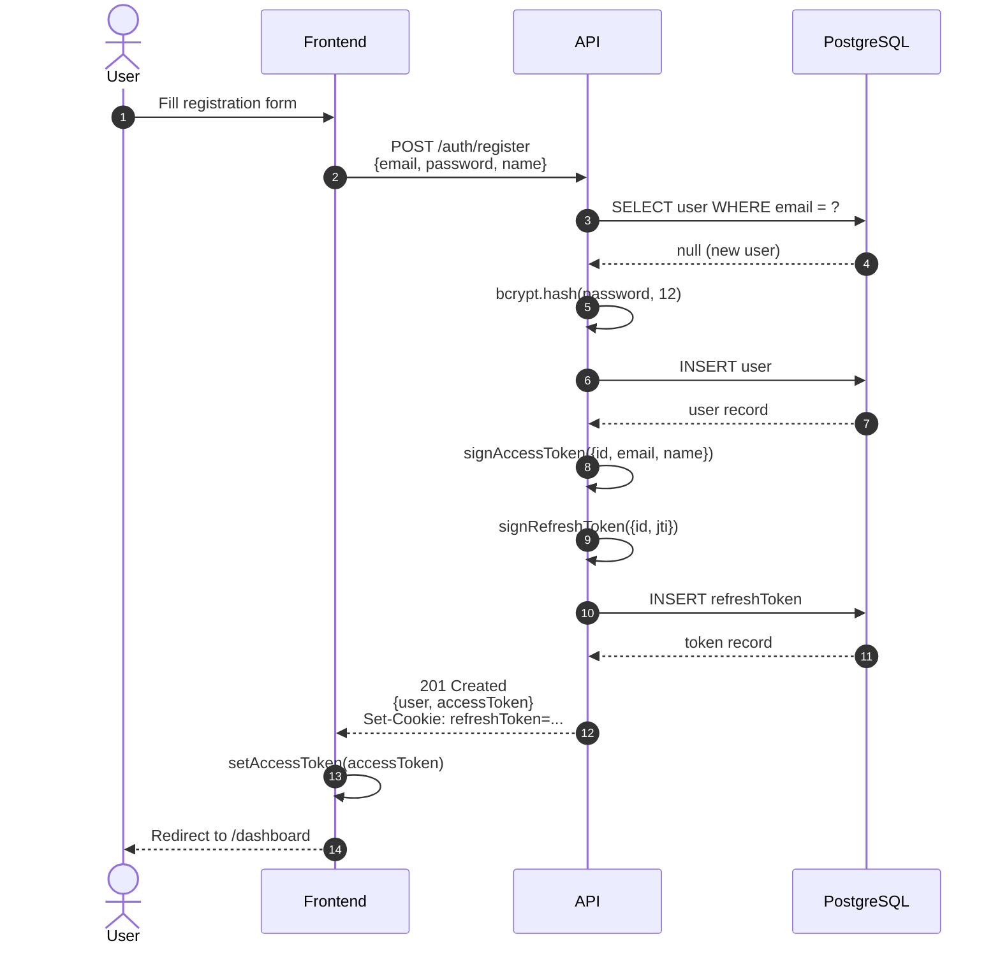
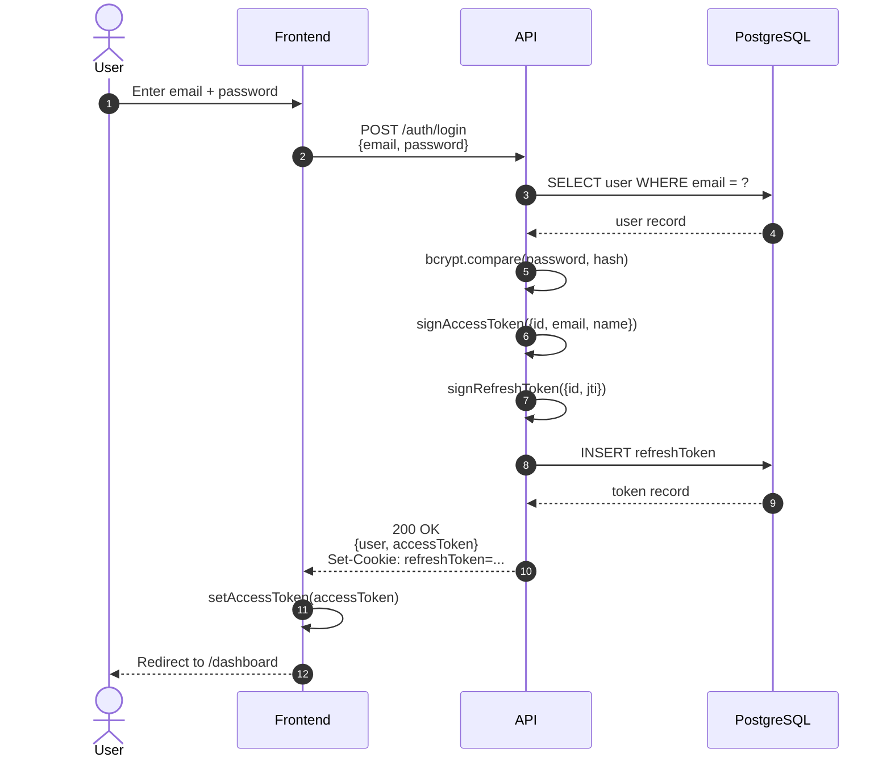
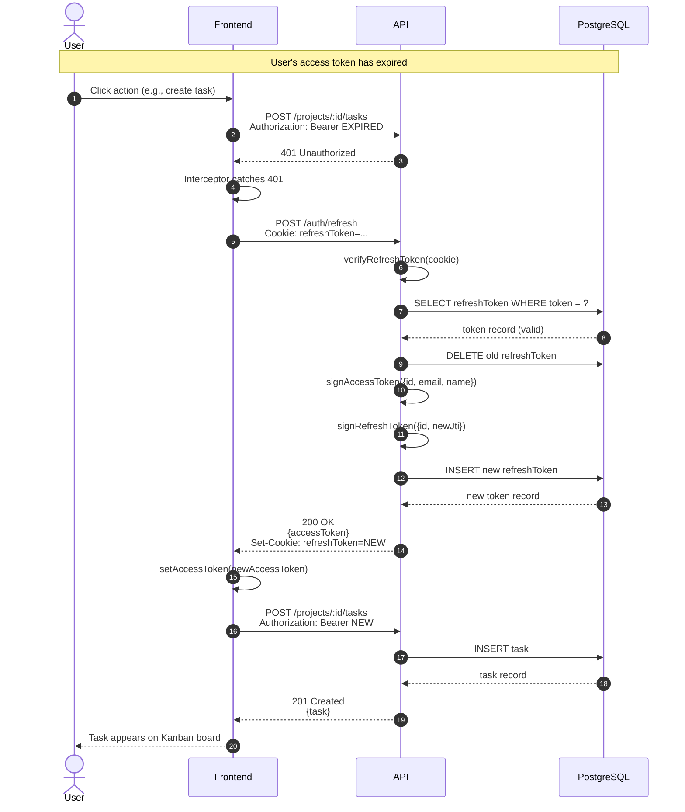
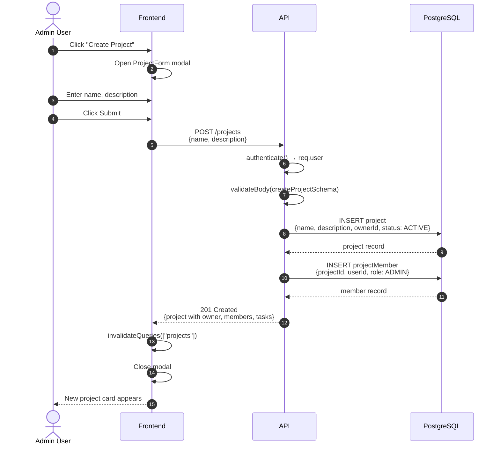
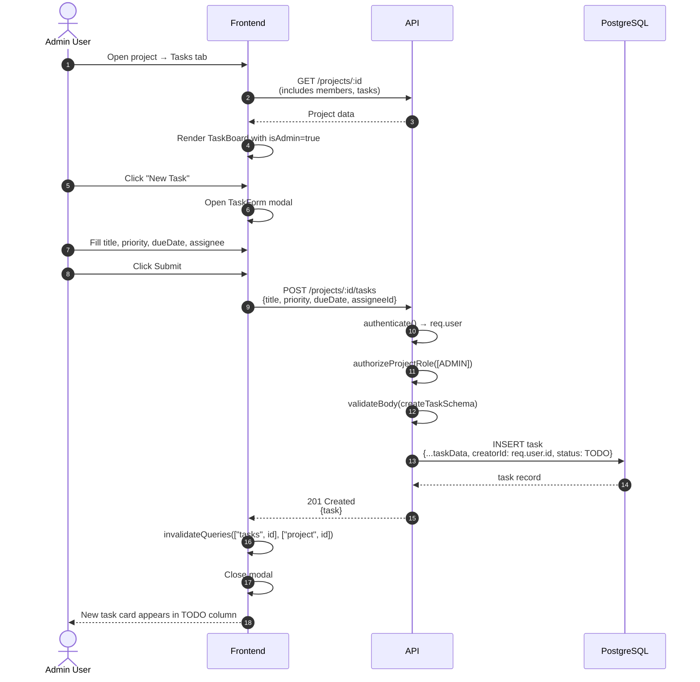
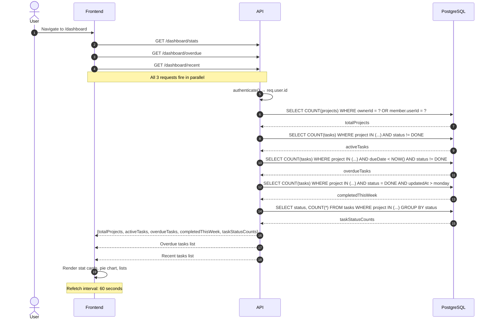
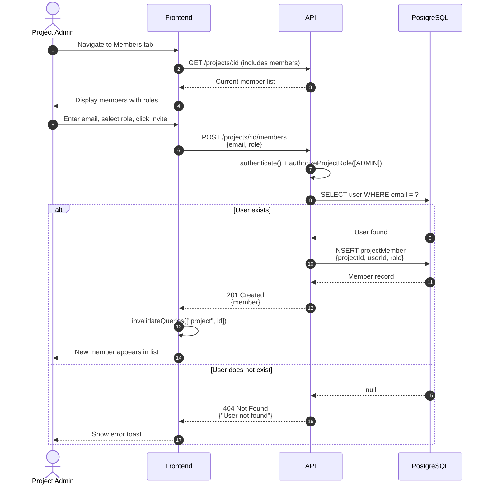
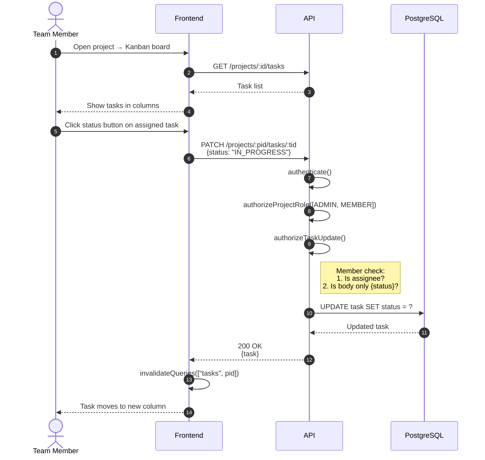

# Architecture Document: Team Task Manager

**Version:** 1.0  
**Last Updated:** May 2026  
**Status:** Production

---

## Table of Contents

1. [System Overview](#1-system-overview)
2. [High-Level Architecture](#2-high-level-architecture)
3. [Monorepo Structure](#3-monorepo-structure)
4. [Backend Architecture](#4-backend-architecture)
5. [Frontend Architecture](#5-frontend-architecture)
6. [Authentication Flow](#6-authentication-flow)
7. [Authorization & RBAC](#7-authorization--rbac)
8. [Data Flow Diagrams](#8-data-flow-diagrams)
9. [Sequence Diagrams](#9-sequence-diagrams)
10. [Database Design](#10-database-design)
11. [API Design Patterns](#11-api-design-patterns)
12. [Error Handling Strategy](#12-error-handling-strategy)
13. [Deployment Architecture](#13-deployment-architecture)
14. [Technology Decisions](#14-technology-decisions)

---

## 1. System Overview

Team Task Manager is a **3-tier web application** consisting of:

| Tier | Technology | Responsibility |
|------|------------|----------------|
| **Presentation** | React 19 + Vite | User interface, client-side routing, state management |
| **Application** | Express.js + Prisma | Business logic, authentication, authorization, data access |
| **Data** | PostgreSQL | Persistent storage for users, projects, tasks, and tokens |

The application follows a **clean architecture** pattern with clear separation of concerns:
- Routes define the HTTP interface
- Controllers handle request/response mechanics
- Services encapsulate business logic
- Prisma ORM manages database access

---

## 2. High-Level Architecture

```
┌─────────────────────────────────────────────────────────────────────────────┐
│                              CLIENT BROWSER                                  │
│  ┌──────────────────────────────────────────────────────────────────────┐   │
│  │  React 19 SPA (Vite)                                                  │   │
│  │  ├── React Router v7                                                  │   │
│  │  ├── TanStack Query v5  ←── Server-state cache                       │   │
│  │  ├── Axios + Interceptors  ←── Token refresh logic                   │   │
│  │  └── Tailwind CSS + Lucide Icons                                      │   │
│  └──────────────────────────────────────────────────────────────────────┘   │
│                                    │                                        │
│                               HTTPS / JSON                                   │
│                                    ▼                                        │
└─────────────────────────────────────────────────────────────────────────────┘
                                    │
┌─────────────────────────────────────────────────────────────────────────────┐
│                            RAILWAY PLATFORM                                  │
│  ┌─────────────────────────────┐    ┌─────────────────────────────────────┐  │
│  │  Web Service (Static)        │    │  API Service (Node.js)              │  │
│  │  └── serve / nginx           │◄──►│  ├── Express.js                     │  │
│  │      Serves dist/ folder     │    │  ├── Prisma Client                 │  │
│  │                              │    │  └── Business Logic                │  │
│  └─────────────────────────────┘    └──────────────┬──────────────────────┘  │
│                                                     │                        │
│                                              PostgreSQL                      │
│                                              Connection                      │
│                                                     │                        │
│  ┌──────────────────────────────────────────────────┘                        │
│  │  PostgreSQL Database (Railway Managed)                                     │
│  │  ├── Users, RefreshTokens                                                  │
│  │  ├── Projects, ProjectMembers                                              │
│  │  └── Tasks                                                                 │
│  └───────────────────────────────────────────────────────────────────────────┘
└─────────────────────────────────────────────────────────────────────────────┘
```

---

## 3. Monorepo Structure

```
team-task-manager/                    # Root workspace
│
├── turbo.json                        # Turborepo pipeline: build order
├── package.json                      # Workspaces: ["apps/*", "packages/*"]
│
├── packages/
│   └── shared/                       # @ttm/shared
│       ├── src/schemas.ts            # Zod schemas (shared validation)
│       ├── src/types.ts              # Inferred TypeScript types
│       └── package.json              # Published to workspace
│
├── apps/
│   ├── api/                          # @ttm/api
│   │   ├── src/                      # Source code (see §4)
│   │   ├── prisma/                   # Schema + migrations
│   │   └── package.json
│   │
│   └── web/                          # @ttm/web
│       ├── src/                      # Source code (see §5)
│       ├── dist/                     # Vite build output
│       └── package.json
│
└── deploy/web/                       # Standalone deploy bundle
    ├── dist/                         # Copied from apps/web/dist
    ├── package.json                  # serve dependency
    └── railway.json                  # Static hosting config
```

### Build Pipeline (Turborepo)

```
shared:build ───────┬───► api:build
                    └───► web:build
```

`turbo.json` ensures `@ttm/shared` builds first. Its `dist/` is then available for `api` and `web` to import via workspace symlinks.

---

## 4. Backend Architecture

### Layered Architecture

The backend follows a strict **4-layer architecture** with unidirectional data flow:

```
┌─────────────────────────────────────────────────────────────┐
│  LAYER 1: ROUTES                                             │
│  ├── Define HTTP endpoints                                   │
│  ├── Apply middleware chain (auth, RBAC, validation)         │
│  └── Delegate to controllers                                 │
│                                                              │
│  Example: project.routes.ts                                  │
│  router.get("/:id", authorizeProjectRole([ADMIN, MEMBER]),   │
│                    getProject);                               │
└─────────────────────────────────────────────────────────────┘
                              │
                              ▼
┌─────────────────────────────────────────────────────────────┐
│  LAYER 2: CONTROLLERS                                        │
│  ├── Extract data from req (params, body, user)              │
│  ├── Call service functions                                  │
│  ├── Wrap results in successResponse()                       │
│  └── Handle errors via next(err)                             │
│                                                              │
│  Example: project.controller.ts                              │
│  const project = await projectService.getProjectById(id);    │
│  res.status(200).json(successResponse(project));              │
└─────────────────────────────────────────────────────────────┘
                              │
                              ▼
┌─────────────────────────────────────────────────────────────┐
│  LAYER 3: SERVICES                                           │
│  ├── Implement business logic                                │
│  ├── Perform Prisma queries                                  │
│  ├── Enforce business rules (last-admin guard, etc.)         │
│  └── Throw ApiError for failures                             │
│                                                              │
│  Example: project.service.ts                                 │
│  if (adminCount <= 1) throw errorResponse("VALIDATION_ERROR");│
└─────────────────────────────────────────────────────────────┘
                              │
                              ▼
┌─────────────────────────────────────────────────────────────┐
│  LAYER 4: PRISMA ORM                                         │
│  ├── Type-safe database queries                              │
│  ├── Connection pooling                                      │
│  ├── Migration management                                    │
│  └── Schema enforcement                                      │
│                                                              │
│  Example: prisma.project.findUnique({ include: { ... } })    │
└─────────────────────────────────────────────────────────────┘
```

### Middleware Stack

Middleware is applied in a **pipeline pattern**. Each middleware can short-circuit the request or pass control to the next handler via `next()`.

```
Request
  │
  ├──► helmet()           ──► Security headers (CSP, HSTS, etc.)
  │
  ├──► cors()             ──► Origin validation, credentials
  │
  ├──► rateLimit()        ──► 100 req / 15 min / IP
  │
  ├──► express.json()     ──► Parse JSON body
  │
  ├──► cookieParser()     ──► Parse cookies
  │
  ├──► Route Middleware:
  │      ├──► authenticate()       ──► Verify Bearer JWT → req.user
  │      ├──► authorizeProjectRole() ──► Verify membership → req.projectMember
  │      ├──► authorizeTaskUpdate()  ──► Field-level task restrictions
  │      └──► validateBody()       ──► Zod schema validation
  │
  ├──► Controller         ──► Call service, send response
  │
  └──► errorHandler()     ──► Catch unhandled errors (MUST be last)
```

### Request Lifecycle

```
┌─────────┐    ┌─────────────┐    ┌──────────────┐    ┌─────────┐    ┌──────────┐
│ Client  │───►│   Express   │───►│ Middleware   │───►│ Controller│───►│ Service  │
│ Request │    │   Server    │    │ Pipeline     │    │           │    │          │
└─────────┘    └─────────────┘    └──────────────┘    └─────┬─────┘    └────┬─────┘
                                                             │               │
                                                             │               ▼
                                                             │         ┌──────────┐
                                                             │         │  Prisma  │
                                                             │         │  Client  │
                                                             │         └────┬─────┘
                                                             │              │
                                                             │              ▼
                                                             │         ┌──────────┐
                                                             │         │ PostgreSQL│
                                                             │         └──────────┘
                                                             │
                                                             ▼
                                                       ┌──────────────┐
                                                       │ successResponse│
                                                       │ or next(err)   │
                                                       └───────┬──────┘
                                                               │
                                                               ▼
                                                       ┌──────────────┐
                                                       │ errorHandler │
                                                       │ (if error)   │
                                                       └───────┬──────┘
                                                               │
                                                               ▼
                                                       ┌──────────────┐
                                                       │ JSON Response │
                                                       │ {success, ...}│
                                                       └───────────────┘
```

---

## 5. Frontend Architecture

### Component Hierarchy

```
<BrowserRouter>
  └── <QueryClientProvider>
        └── <ToastProvider>
              └── <AuthProvider>
                    └── <Routes>
                          ├── /login ──► <LoginPage />
                          ├── /register ──► <RegisterPage />
                          └── Protected Routes ──► <ProtectedRoute>
                                    └── <AppLayout>
                                          ├── <Sidebar />
                                          ├── <Topbar />
                                          └── <main>
                                                ├── /dashboard ──► <DashboardPage>
                                                │                     ├── <StatCard /> × 4
                                                │                     ├── <StatusChart />
                                                │                     ├── <OverdueList />
                                                │                     └── <RecentActivity />
                                                ├── /projects ──► <ProjectsPage>
                                                │                     ├── <ProjectCard /> × N
                                                │                     └── <ProjectForm /> (modal)
                                                ├── /projects/:id ──► <ProjectDetailPage>
                                                │                         ├── Tabs: Tasks / Members / Settings
                                                │                         ├── <TaskBoard /> (Tasks tab)
                                                │                         │     ├── <StatusColumn /> × 4
                                                │                         │     │     └── <TaskCard /> × N
                                                │                         │     └── <TaskForm /> (modal)
                                                │                         ├── <MemberList /> (Members tab)
                                                │                         └── <ProjectForm /> (Settings tab)
                                                ├── /projects/:pid/tasks/:tid ──► <TaskDetailPage>
                                                │                                     ├── <TaskForm /> (edit modal)
                                                │                                     └── Status dropdown
                                                └── /profile ──► <ProfilePage />
```

### State Management Architecture

The frontend uses a **hybrid state management** approach:

| State Type | Library / Pattern | Scope |
|------------|-------------------|-------|
| **Server State** | TanStack Query | API data (projects, tasks, dashboard) |
| **Auth State** | React Context | Current user, login status |
| **UI State** | useState (local) | Modals, form inputs, active tabs |
| **Notifications** | React Context + imperative API | Toast messages |

```
┌──────────────────────────────────────────────────────────────┐
│                    SERVER STATE (TanStack Query)              │
│                                                               │
│   useProjects() ──► QueryCache["projects"]                    │
│   useProject(id) ──► QueryCache["project", id]                │
│   useTasks(pid) ──► QueryCache["tasks", pid]                  │
│   useDashboardStats() ──► QueryCache["dashboard", "stats"]    │
│                    (refetchInterval: 60000)                   │
│                                                               │
│   Mutations invalidate related keys on success:               │
│   createTask ──► invalidate ["tasks", pid], ["project", pid]  │
└──────────────────────────────────────────────────────────────┘
                              │
                              │ fetches via
                              ▼
┌──────────────────────────────────────────────────────────────┐
│                      API CLIENT (Axios)                       │
│                                                               │
│   Request Interceptor: attach Bearer accessToken              │
│                                                               │
│   Response Interceptor:                                       │
│   ├── 401 → queue request → POST /auth/refresh                │
│   │         → retry with new token                            │
│   ├── 403 → showToast("Access denied")                        │
│   └── Network error → showToast("Network error...")           │
└──────────────────────────────────────────────────────────────┘
```

### Token Storage Architecture

```
┌─────────────────────────────────────────────────────────────┐
│                    TOKEN STORAGE MODEL                       │
├─────────────────────────────────────────────────────────────┤
│                                                              │
│   ┌─────────────┐         ┌─────────────────────────────┐   │
│   │   Memory    │         │     HTTP-Only Cookie        │   │
│   │ (JS heap)   │         │  (Browser, inaccessible to  │   │
│   │             │         │   JavaScript / XSS-safe)    │   │
│   │ accessToken │◄────────│   refreshToken              │   │
│   │ 15 min TTL  │         │   7 day TTL                 │   │
│   └─────────────┘         │   SameSite=strict           │   │
│                           │   Secure (production)       │   │
│                           └─────────────────────────────┘   │
│                                                              │
│   Why this pattern?                                          │
│   • XSS cannot steal accessToken (not in localStorage)       │
│   • XSS cannot steal refreshToken (HTTP-only cookie)         │
│   • CSRF mitigated by SameSite=strict + CORS origin check    │
│   • Short-lived accessToken limits blast radius if leaked    │
│   • Refresh token rotation prevents replay attacks           │
│                                                              │
└─────────────────────────────────────────────────────────────┘
```

---

## 6. Authentication Flow

### Registration Flow



### Login Flow



### Token Refresh Flow



### Concurrent Request Handling During Refresh

```
Request 1 ──► 401 ──► triggers refresh ──► queues Request 2, 3
                              │
                              ▼
                    POST /auth/refresh
                              │
                              ▼
                    New token received
                              │
              ┌───────────────┼───────────────┐
              ▼               ▼               ▼
         Request 1      Request 2      Request 3
         (retry)        (retry)        (retry)
```

The axios interceptor implements a **token refresh queue**:
- First 401 request triggers the refresh API call
- Subsequent 401s are queued via `refreshSubscribers` array
- When refresh completes, all queued requests are replayed with the new token

---

## 7. Authorization & RBAC

### Role-Based Access Control Model

TTM uses a **resource-based RBAC** model where permissions are tied to project membership, not global user roles.

```
┌────────────────────────────────────────────────────────────────┐
│                     RBAC DECISION FLOW                          │
│                                                                 │
│   Request arrives at /projects/:id/tasks                        │
│                      │                                          │
│                      ▼                                          │
│   ┌─────────────────────────────────────┐                      │
│   │ authenticate()                      │                      │
│   │ ├── Check Authorization header      │                      │
│   │ ├── Verify JWT signature            │                      │
│   │ └── Attach req.user = {id, email, name}                     │
│   └──────────────┬──────────────────────┘                      │
│                  │                                              │
│                  ▼                                              │
│   ┌─────────────────────────────────────┐                      │
│   │ authorizeProjectRole([ADMIN, MEMBER])│                     │
│   │ ├── Extract projectId from params   │                      │
│   │ ├── Query project_members table     │                      │
│   │ ├── Check: is user a member?        │                      │
│   │ └── Check: does user's role match?  │                      │
│   │     └── Attach req.projectMember    │                      │
│   └──────────────┬──────────────────────┘                      │
│                  │                                              │
│                  ▼                                              │
│   ┌─────────────────────────────────────┐                      │
│   │ authorizeTaskUpdate() (PATCH only)  │                      │
│   │ ├── Is user ADMIN? → ALLOW ALL      │                      │
│   │ ├── Is user MEMBER?                 │                      │
│   │ │   ├── Is user the assignee?       │                      │
│   │ │   └── Is body.status the only field?                      │
│   │ └── No? → 403 FORBIDDEN             │                      │
│   └──────────────┬──────────────────────┘                      │
│                  │                                              │
│                  ▼                                              │
│              Controller → Service → Prisma → Response           │
└────────────────────────────────────────────────────────────────┘
```

### Authorization Matrix

| Endpoint | Auth | Project Member | Project Admin | Task Assignee |
|----------|------|----------------|---------------|---------------|
| `POST /projects` | ✅ | N/A | N/A | N/A |
| `GET /projects` | ✅ | N/A | N/A | N/A |
| `GET /projects/:id` | ✅ | ✅ | ✅ | N/A |
| `PATCH /projects/:id` | ✅ | ❌ | ✅ | N/A |
| `DELETE /projects/:id` | ✅ | ❌ | ✅ | N/A |
| `POST /projects/:id/members` | ✅ | ❌ | ✅ | N/A |
| `DELETE /projects/:id/members/:uid` | ✅ | ❌ | ✅ | N/A |
| `PATCH /projects/:id/members/:uid` | ✅ | ❌ | ✅ | N/A |
| `POST /projects/:pid/tasks` | ✅ | ❌ | ✅ | N/A |
| `GET /projects/:pid/tasks` | ✅ | ✅ | ✅ | N/A |
| `PATCH /projects/:pid/tasks/:tid` | ✅ | ❌ | ✅ (all fields) | ✅ (status only) |
| `DELETE /projects/:pid/tasks/:tid` | ✅ | ❌ | ✅ | N/A |

---

## 8. Data Flow Diagrams

### Project Creation Flow



### Task Creation & Kanban Update Flow



### Dashboard Data Aggregation Flow



---

## 9. Sequence Diagrams

### Member Invitation Flow



### Task Status Update (Member)



---

## 10. Database Design

### Schema Overview

```sql
-- Users
CREATE TABLE "User" (
    id          UUID PRIMARY KEY DEFAULT gen_random_uuid(),
    email       TEXT UNIQUE NOT NULL,
    passwordHash TEXT NOT NULL,
    name        TEXT NOT NULL,
    avatarUrl   TEXT,
    createdAt   TIMESTAMP DEFAULT now(),
    updatedAt   TIMESTAMP DEFAULT now()
);

-- Projects
CREATE TABLE "Project" (
    id          UUID PRIMARY KEY DEFAULT gen_random_uuid(),
    name        TEXT NOT NULL,
    description TEXT,
    status      TEXT DEFAULT 'ACTIVE',  -- ACTIVE | ARCHIVED
    ownerId     UUID NOT NULL REFERENCES "User"(id),
    createdAt   TIMESTAMP DEFAULT now(),
    updatedAt   TIMESTAMP DEFAULT now()
);

-- Project Members (join table)
CREATE TABLE "ProjectMember" (
    id          UUID PRIMARY KEY DEFAULT gen_random_uuid(),
    projectId   UUID NOT NULL REFERENCES "Project"(id) ON DELETE CASCADE,
    userId      UUID NOT NULL REFERENCES "User"(id) ON DELETE CASCADE,
    role        TEXT DEFAULT 'MEMBER',  -- ADMIN | MEMBER
    joinedAt    TIMESTAMP DEFAULT now(),
    UNIQUE(projectId, userId)
);

-- Tasks
CREATE TABLE "Task" (
    id          UUID PRIMARY KEY DEFAULT gen_random_uuid(),
    title       TEXT NOT NULL,
    description TEXT,
    status      TEXT DEFAULT 'TODO',     -- TODO | IN_PROGRESS | REVIEW | DONE
    priority    TEXT DEFAULT 'MEDIUM',   -- LOW | MEDIUM | HIGH | URGENT
    dueDate     TIMESTAMP,
    projectId   UUID NOT NULL REFERENCES "Project"(id) ON DELETE CASCADE,
    assigneeId  UUID REFERENCES "User"(id) ON DELETE SET NULL,
    creatorId   UUID NOT NULL REFERENCES "User"(id),
    createdAt   TIMESTAMP DEFAULT now(),
    updatedAt   TIMESTAMP DEFAULT now()
);

-- Refresh Tokens
CREATE TABLE "RefreshToken" (
    id          UUID PRIMARY KEY DEFAULT gen_random_uuid(),
    token       TEXT UNIQUE NOT NULL,
    userId      UUID NOT NULL REFERENCES "User"(id) ON DELETE CASCADE,
    expiresAt   TIMESTAMP NOT NULL,
    createdAt   TIMESTAMP DEFAULT now()
);
```

### Indexes

| Table | Index | Purpose |
|-------|-------|---------|
| `User` | `email` (unique) | Login lookup |
| `ProjectMember` | `(projectId, userId)` (unique) | Membership check |
| `ProjectMember` | `userId` | Find user's projects |
| `Task` | `projectId` | Project task listing |
| `Task` | `assigneeId` | User's assigned tasks |
| `RefreshToken` | `token` (unique) | Token validation |
| `RefreshToken` | `userId` | User logout cleanup |

### Relationships Diagram

```
┌─────────────┐         ┌─────────────────┐         ┌─────────────┐
│    User     │◄───────│  ProjectMember  │───────►│   Project   │
│  (1 owner)  │   1:N   │   (junction)    │   N:1   │  (1 owner)  │
│             │◄───────│                 │         │             │
│  (assignee) │   1:N   │  UNIQUE(projectId, userId)              │
│  (creator)  │         │                 │         │  (cascade)  │
└──────┬──────┘         └─────────────────┘         └──────┬──────┘
       │                                                   │
       │              ┌─────────────┐                      │
       │              │    Task     │◄─────────────────────┘
       └─────────────►│             │         1:N
         (assignee)   │  projectId  │         (cascade)
         (creator)    │  assigneeId │
                      │  creatorId  │
                      └─────────────┘
```

---

## 11. API Design Patterns

### Uniform Response Envelope

Every API response follows the same structure:

```typescript
// Success
interface ApiSuccess<T> {
  success: true;
  data: T;
  meta?: Record<string, unknown>;
}

// Error
interface ApiError {
  success: false;
  error: {
    code: string;        // Machine-readable error code
    message: string;     // Human-readable description
    details?: Array<{    // Optional field-level errors
      field?: string;
      message: string;
    }>;
  };
}
```

### HTTP Status Code Conventions

| Status | Usage |
|--------|-------|
| 200 OK | Successful read/update/delete |
| 201 Created | Successful resource creation |
| 400 Bad Request | Validation errors, business rule violations |
| 401 Unauthorized | Missing/invalid authentication |
| 403 Forbidden | Insufficient permissions (RBAC denial) |
| 404 Not Found | Resource does not exist |
| 409 Conflict | Duplicate data (unique constraint violation) |
| 500 Internal Server Error | Unexpected errors |

### Endpoint Naming Convention

- **RESTful plural nouns:** `/projects`, `/projects/:id/tasks`
- **Nested resources:** Tasks are nested under projects (`/projects/:pid/tasks/:tid`)
- **Actions as sub-resources:** Members managed via `/projects/:id/members`
- **No verbs in URLs:** Use HTTP methods instead (`POST /projects` = create, not `/projects/create`)

---

## 12. Error Handling Strategy

### Layered Error Handling

```
┌─────────────────────────────────────────────────────────────┐
│  ERROR SOURCES                                               │
├─────────────────────────────────────────────────────────────┤
│                                                              │
│  1. Zod Validation (validateBody middleware)                │
│     └── 400 VALIDATION_ERROR with field details             │
│                                                              │
│  2. Prisma Database Errors                                  │
│     ├── P2002 (unique constraint) → 409 CONFLICT            │
│     ├── P2025 (record not found) → 404 NOT_FOUND            │
│     └── Other → 500 INTERNAL_ERROR                          │
│                                                              │
│  3. Business Logic (services)                               │
│     └── throw errorResponse(code, message, status)          │
│         Examples:                                           │
│         • Last admin removal → 400 VALIDATION_ERROR         │
│         • Invalid credentials → 401 UNAUTHORIZED            │
│         • Non-member access → 403 FORBIDDEN                 │
│                                                              │
│  4. JWT Errors                                              │
│     ├── TokenExpiredError → 401 UNAUTHORIZED                │
│     └── JsonWebTokenError → 401 UNAUTHORIZED                │
│                                                              │
│  5. Unexpected Errors                                       │
│     └── 500 INTERNAL_ERROR (dev: show message, prod: hide)  │
│                                                              │
└─────────────────────────────────────────────────────────────┘
                              │
                              ▼
┌─────────────────────────────────────────────────────────────┐
│  CENTRALIZED ERROR HANDLER                                   │
│  (Express errorHandler middleware — LAST in stack)           │
│                                                              │
│  • Catches all errors via next(err)                         │
│  • Checks instanceof for typed errors                       │
│  • Returns standardized JSON response                       │
│  • Logs unexpected errors to console                        │
└─────────────────────────────────────────────────────────────┘
```

### Frontend Error Handling

```
API Error
    │
    ├──► 401 (expired token)
    │      └──► Interceptor refreshes token → retries request
    │
    ├──► 401 (refresh failed)
    │      └──► Clear auth → stay on page (no hard redirect)
    │
    ├──► 403 (RBAC denial)
    │      └──► showToast("Access denied", "error")
    │
    ├──► 400/409/404
    │      └──► Display error message in form or toast
    │
    └──► 500 / Network Error
           └──► showToast("Something went wrong", "error")
```

---

## 13. Deployment Architecture

### Railway Deployment Topology

```
┌─────────────────────────────────────────────────────────────────┐
│                         RAILWAY PLATFORM                         │
│                                                                  │
│  ┌─────────────────────┐      ┌─────────────────────────────┐  │
│  │   Web Service       │      │   API Service               │  │
│  │   (Static Hosting)  │      │   (Node.js Runtime)         │  │
│  │                     │      │                             │  │
│  │  • serve / nginx    │      │  • Express server           │  │
│  │  • Port: $PORT      │      │  • Port: 3001               │  │
│  │  • SPA fallback     │◄────►│  • Prisma migrate on start  │  │
│  │  • Asset caching    │      │  • CORS: web origin only    │  │
│  │                     │      │                             │  │
│  │  Env:               │      │  Env:                       │  │
│  │  VITE_API_URL       │      │  DATABASE_URL               │  │
│  │                     │      │  JWT_SECRET                 │  │
│  └─────────────────────┘      │  JWT_REFRESH_SECRET         │  │
│                               │  FRONTEND_URL               │  │
│                               └─────────────┬───────────────┘  │
│                                             │                   │
│  ┌──────────────────────────────────────────┘                   │
│  │  PostgreSQL Service (Managed)                                  │
│  │  ├── Automatic backups                                         │
│  │  ├── SSL connections                                           │
│  │  └── Private networking                                        │
│  └────────────────────────────────────────────────────────────────┘
└─────────────────────────────────────────────────────────────────┘
```

### CI/CD Flow

```
Developer Machine
        │
        ├──► Local dev: npm run dev (turbo)
        │
        ├──► Build web: VITE_API_URL=<prod> npm run build
        │      └──► Output: apps/web/dist/
        │
        ├──► Copy to deploy/web/dist/
        │
        └──► Deploy
               ├──► railway up --service api
               │      └──► Nixpacks builds API → runs migrate → starts server
               │
               └──► cd deploy/web && railway up . --path-as-root --no-gitignore
                      └──► Nixpacks installs serve → serves static files
```

### Environment Configuration

| Environment | API Base | Frontend | Database |
|-------------|----------|----------|----------|
| **Development** | `http://localhost:3001/api/v1` | `http://localhost:5173` | Docker PostgreSQL |
| **Production** | `https://<api>.railway.app/api/v1` | `https://<web>.railway.app` | Railway PostgreSQL |

---

## 14. Technology Decisions

### Why Express + Prisma?

| Alternative | Why Not Chosen | Why Express + Prisma |
|-------------|----------------|----------------------|
| NestJS | Adds complexity for a medium-sized API | Express is lightweight, well-understood, fast to develop |
| TypeORM | Less type-safe, slower development | Prisma generates types from schema, excellent DX |
| Raw SQL | Error-prone, no migrations | Prisma handles migrations, connection pooling, type safety |

### Why React + Vite (not Next.js)?

| Alternative | Why Not Chosen | Why React + Vite |
|-------------|----------------|------------------|
| Next.js | Overkill for a dashboard SPA; API is separate | Vite is faster in dev, simpler config, explicit control |
| Create React App | Deprecated, slow builds | Vite is the modern standard |
| Vue / Svelte | Team familiarity with React | React ecosystem, large community |

### Why TanStack Query over Redux?

| Redux | TanStack Query |
|-------|----------------|
| Manual caching logic | Automatic caching, stale-while-revalidate |
| Boilerplate heavy | Minimal code for data fetching |
| No built-in sync | Background refetching, mutation invalidation |
| Global state for everything | Server state separate from UI state |

### Why in-memory tokens over localStorage?

| localStorage | In-Memory + Cookie |
|--------------|-------------------|
| Vulnerable to XSS extraction | XSS cannot access memory or HTTP-only cookies |
| Simple to implement | Slightly more complex (refresh queue) |
| Tokens persist across tabs | Tokens lost on page refresh (handled by refresh) |
| Industry standard for SPAs | More secure, modern best practice |

### Why npm workspaces over pnpm/yarn?

| pnpm | npm workspaces |
|------|----------------|
| Faster installs, disk efficient | Zero additional tool to learn |
| Stricter hoisting | Simpler CI/CD (standard npm) |
| | `packageManager` field ensures consistency |

---

## Appendix: Glossary

| Term | Definition |
|------|------------|
| **RBAC** | Role-Based Access Control — permissions based on user roles |
| **JWT** | JSON Web Token — signed token for stateless authentication |
| **Prisma** | Type-safe ORM for Node.js and TypeScript |
| **TanStack Query** | Data synchronization library for React (formerly React Query) |
| **Nixpacks** | Railway's build system that auto-detects project type |
| **SPA** | Single Page Application — client-side rendered web app |
| **CORS** | Cross-Origin Resource Sharing — browser security mechanism |
| **HTTP-only cookie** | Cookie inaccessible to JavaScript, mitigating XSS |
